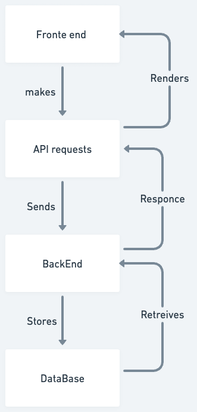
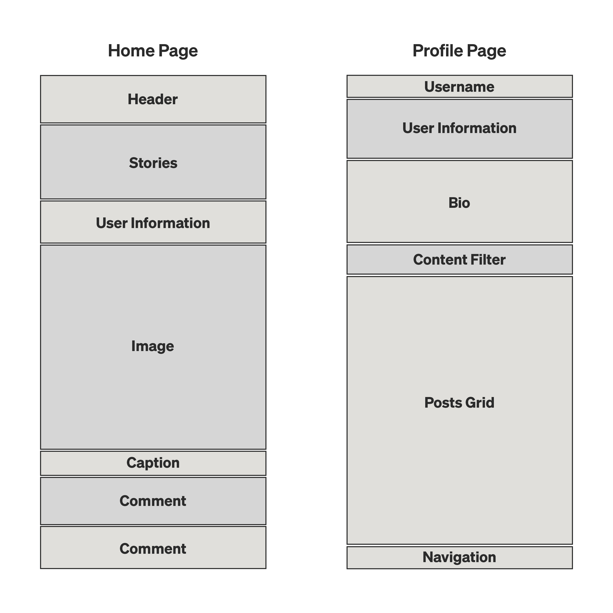

# Instagram Clone


### `Project Objective`
To create a functional social media platform similar to Instagram, allowing users 
to share photos and videos and interact with each other's posts utlizing React as our front-end framework and Python, Django, and PostgreSQL for our back-end. 

### `MVP`
Re-create two essential Instagram features/pages: the homepage aka the "feed" and the user profile. Create a functional user authorization (using the built-in Django authorization), allowing users to create accounts, log in to the accounts, create posts on their own page and intereact with other users content in a comments section. Implement Headless UI as the building block for our front-end component design to create a modern UI experience. Successfully deploy the front-end using Vercel and the backend using Heroku. 

### `Post MVP`
Create individual post pages as part of a user feed, implement a "Like" feature. Implement a "dislike" feature that will replace any post with enough dislikes with a picture of a dog.

### `Division of Labor`
In general, Miguel will be leading the charge for front-end component design and Jasmine/Joe will be handling back-end design. We plan to all collaborate on visual design and learn to use Headless UI together. For a more in depth breakdown of the division of labor, please see our [Notion Board](https://www.notion.so/b7987fb8ec134acb8f88fe8920586b35?v=787ef2ffb9b94130ad2a35d453afbe32&pvs=4).

### `Whimsical`
[](whimsical.png)

### `Component Tree`
We plan to closely follow Instagram as a model for the components on the two pages noted in our MVP: the homepage and the profile.



### `Schema`
Our database will be comprised of User, Post, and Comment models with keys linking these three models to track the interactions between them.

```python
class User(models.Model):
    name = models.CharField(max_length=30)
    username = models.CharField(max_length=30, unique=True)
    password = models.CharField(max_length=30)
    bio = models.TextField(blank=True, null=True)
    profile_picture = models.ImageField(upload_to='profile_pictures/', blank=True, null=True)
    likes = ArrayField(models.ForeignKey(Post), blank=True, null=True)

class Post(models.Model):
    author = models.ForeignKey(User, on_delete=models.CASCADE)f
    image = models.ImageField(upload_to='post_images/')
    caption = models.CharField(max_length=200, blank=True, null=True)
    created_at = models.DateTimeField(auto_now_add=True)
    liked_by = ArrayField(models.ForeignKey(User), blank=True, null=True)

class Comment(models.Model):
    user = models.ForeignKey(User, on_delete=models.CASCADE)
    post = models.ForeignKey(Post, on_delete=models.CASCADE)
    text = models.TextField()
    created_at = models.DateTimeField(auto_now_add=True)
```
### `Routes`
Our backend routes will allow for users to create profiles, log in existing profiles and consequently add posts, comment on existing posts, and edit their profiles.

```python
# Homepage
@app.route('/', methods=['GET'])

# User routes
@app.route('/<username>/', methods=['GET', 'POST']) # Individual user's page
@app.route('/<username>/<id>', methods=['GET']) # Individual post page.
@app.route('/<username>/edit', methods=['GET', 'POST', 'PUT', 'DELETE']) # Edit profile.

# Sign in route
@app.route('/auth/sign-in/', methods=['POST']) 
# Sign up routes
@app.route('auth/sign-up/', methods=['POST']) 
```


